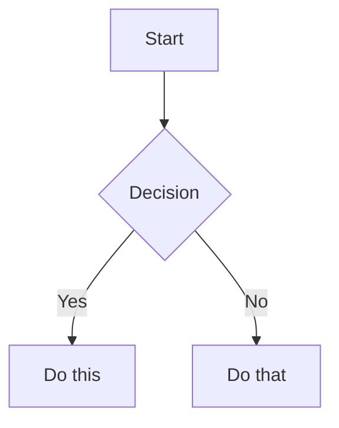

# Documentation Features Guide

This guide explains how to use the enhanced documentation features in Xec docs.

## Mermaid Diagrams

Mermaid diagrams are now fully supported. Simply use markdown code blocks with the `mermaid` language identifier:

````markdown

````

Supported diagram types:
- Flowcharts
- Sequence diagrams
- Class diagrams
- State diagrams
- Entity Relationship diagrams
- Gantt charts
- Git graphs
- And more!

## Mathematical Formulas

Use KaTeX syntax for math formulas:

### Inline Math
```markdown
The formula $a^2 + b^2 = c^2$ is the Pythagorean theorem.
```

### Block Math
```markdown
$$
E = mc^2
$$
```

## Image Optimization

Images are automatically optimized using `@docusaurus/plugin-ideal-image`. Just use regular markdown image syntax:

```markdown

```

The plugin will:
- Generate multiple sizes
- Create responsive images
- Lazy load images
- Support progressive loading

## Sitemap

A sitemap is automatically generated at `/sitemap.xml` for better SEO.

## Additional Features

### Tabs
```jsx
import Tabs from '@theme/Tabs';
import TabItem from '@theme/TabItem';

<Tabs>
  <TabItem value="js" label="JavaScript">
    // JavaScript code
  </TabItem>
  <TabItem value="ts" label="TypeScript">
    // TypeScript code
  </TabItem>
</Tabs>
```

### Admonitions
```markdown
:::note
This is a note
:::

:::tip
This is a tip
:::

:::warning
This is a warning
:::
```

### Code Block Features
- Syntax highlighting for multiple languages
- Line highlighting
- Line numbers
- Copy button

## Testing Features

To see all features in action, visit `/docs/examples/features-demo` in the documentation.

## Configuration

All features are configured in:
- `docusaurus.config.ts` - Main configuration
- `src/css/custom.css` - Custom styles including KaTeX and Mermaid styling

## Dependencies Added

```json
{
  "@docusaurus/theme-mermaid": "3.8.1",
  "@docusaurus/plugin-sitemap": "3.8.1",
  "@docusaurus/plugin-ideal-image": "3.8.1",
  "remark-math": "^6.0.0",
  "rehype-katex": "^7.0.0"
}
```

## Building and Running

```bash
# Install dependencies
yarn install

# Start development server
yarn start

# Build for production
yarn build
```

The documentation is now ready with all enhanced features! 🎉