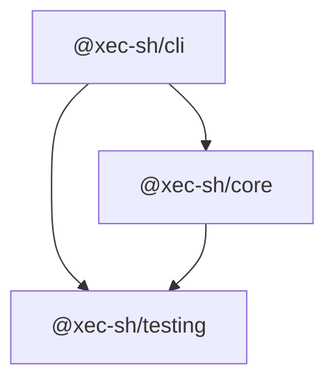
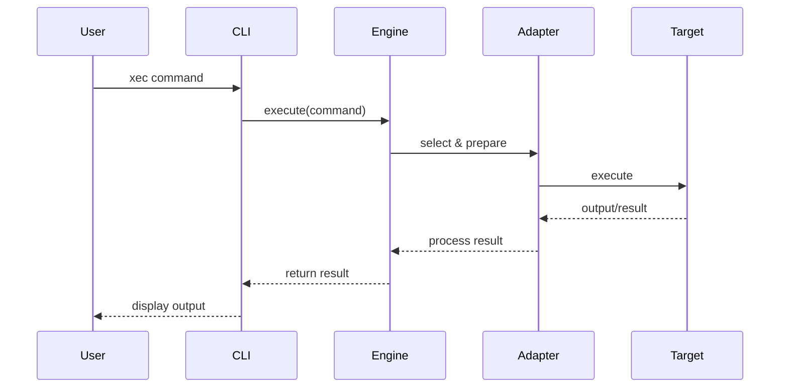
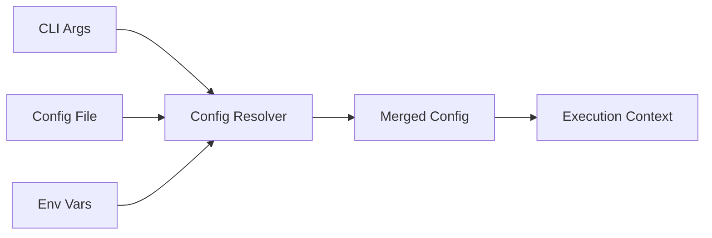
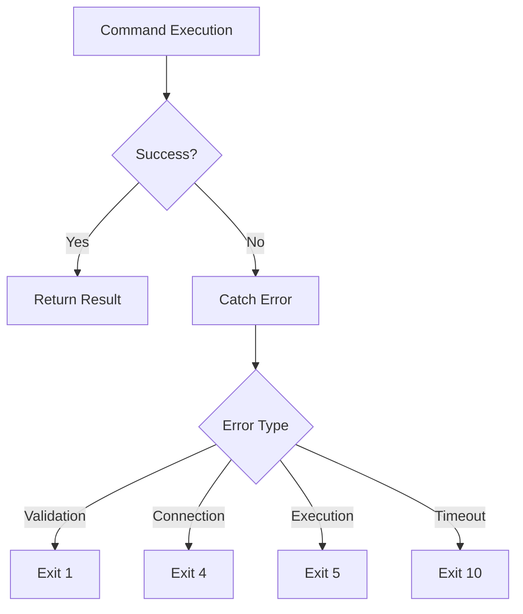
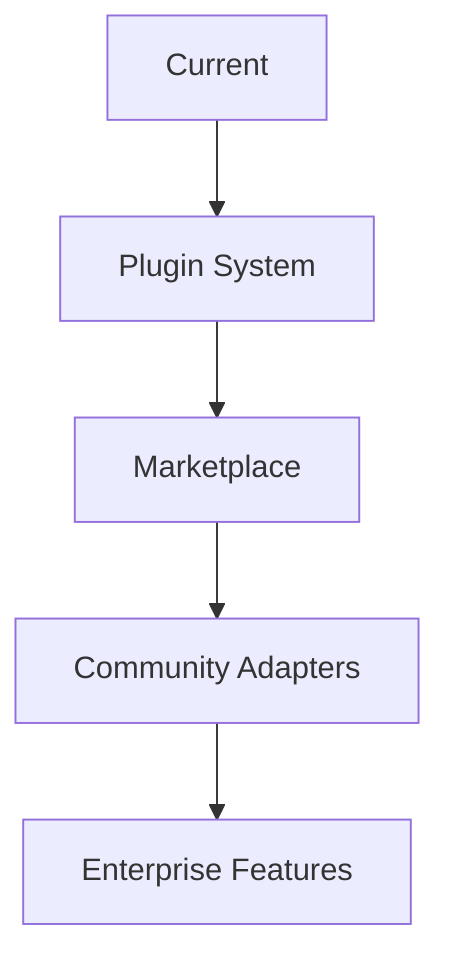

# Architecture

## System Overview

Xec is designed as a modular, extensible system for universal command execution across multiple environments. The architecture emphasizes separation of concerns, type safety, and performance.

## Monorepo Structure

Xec uses a monorepo architecture managed by Turborepo:

```
xec/
├── apps/
│   ├── xec/              # CLI application (@xec-sh/cli)
│   └── docs/             # Documentation site
├── packages/
│   ├── core/             # Core execution engine (@xec-sh/core)
│   └── test-utils/       # Shared testing utilities
├── docker/               # Test containers
└── turbo.json           # Build orchestration
```

### Package Dependencies



## Core Components

### 1. Execution Engine

The execution engine (`packages/core/src/core/execution-engine.ts`) is the central component that:

- Parses command templates
- Selects appropriate adapters
- Manages execution lifecycle
- Handles streaming and buffering
- Provides error handling

```typescript
class ExecutionEngine {
  constructor(private config: ExecutionConfig) {}
  
  async execute(command: string, options?: ExecutionOptions): Promise<Result> {
    const adapter = this.selectAdapter(options);
    const prepared = await adapter.prepare(command);
    const result = await adapter.execute(prepared);
    return this.processResult(result);
  }
}
```

### 2. Adapter System

Adapters (`packages/core/src/adapters/`) provide environment-specific implementations:

#### Base Adapter Interface

```typescript
abstract class BaseAdapter {
  abstract async execute(command: Command): Promise<Result>;
  abstract async connect(): Promise<void>;
  abstract async disconnect(): Promise<void>;
  abstract async validate(): Promise<boolean>;
}
```

#### Adapter Implementations

- **LocalAdapter**: Native process execution
- **SSHAdapter**: Remote execution via SSH
- **DockerAdapter**: Container execution via Docker API
- **KubernetesAdapter**: Pod execution via kubectl
- **RemoteDockerAdapter**: Docker on remote hosts

### 3. Command Builder

The command builder (`packages/core/src/core/command-builder.ts`) constructs executable commands:

```typescript
class CommandBuilder {
  private parts: CommandPart[] = [];
  
  add(part: string | TemplateExpression): this {
    this.parts.push(this.sanitize(part));
    return this;
  }
  
  build(): Command {
    return new Command(this.parts);
  }
}
```

### 4. Connection Management

#### Connection Pool

```typescript
class ConnectionPool<T extends Connection> {
  private available: T[] = [];
  private inUse: Map<string, T> = new Map();
  private pending: Promise<T>[] = [];
  
  async acquire(): Promise<T> {
    // Return available connection or create new
  }
  
  release(connection: T): void {
    // Return connection to pool
  }
}
```

#### SSH Connection Pool

- Maintains persistent SSH connections
- Configurable pool size and idle timeout
- Automatic reconnection on failure
- Connection health checks

### 5. CLI Layer

The CLI (`apps/xec/src/`) provides:

- Command parsing and routing
- Configuration loading
- Script execution
- Task management
- Interactive features

```typescript
// Main CLI entry point
async function main() {
  const command = parseArgs(process.argv);
  const config = await loadConfig();
  const executor = createExecutor(config);
  
  try {
    await executor.run(command);
  } catch (error) {
    handleError(error);
  }
}
```

## Data Flow

### Command Execution Flow



### Configuration Loading



## Template Literal Processing

### Parse Phase

```typescript
// Template literal: $`echo ${variable}`
// Parsed into:
{
  type: 'template',
  parts: [
    { type: 'literal', value: 'echo ' },
    { type: 'expression', value: variable }
  ]
}
```

### Compilation Phase

```typescript
// Compiled to executable command
{
  command: 'echo',
  args: [resolvedVariable],
  env: mergedEnvironment,
  options: executionOptions
}
```

## Error Architecture

### Error Hierarchy

```typescript
class XecError extends Error {
  constructor(
    message: string,
    public code: string,
    public exitCode: number
  ) {
    super(message);
  }
}

class ValidationError extends XecError {}
class ExecutionError extends XecError {}
class ConnectionError extends XecError {}
class TimeoutError extends XecError {}
```

### Error Flow



## Performance Optimizations

### 1. Connection Pooling

- **SSH**: Reuse SSH connections across commands
- **Docker**: Maintain Docker client connections
- **Kubernetes**: Cache kubectl contexts

### 2. Lazy Loading

```typescript
// Commands loaded on demand
const commands = new Map<string, () => Promise<Command>>();

async function loadCommand(name: string) {
  if (!commands.has(name)) {
    commands.set(name, () => import(`./commands/${name}`));
  }
  return commands.get(name)();
}
```

### 3. Stream Processing

```typescript
// Process output as streams instead of buffering
async function* streamOutput(process: ChildProcess) {
  for await (const chunk of process.stdout) {
    yield chunk.toString();
  }
}
```

### 4. Parallel Execution

```typescript
// Execute commands in parallel
async function executeParallel(commands: Command[]) {
  return Promise.all(
    commands.map(cmd => execute(cmd))
  );
}
```

## Security Architecture

### 1. Input Sanitization

```typescript
function sanitizeCommand(input: string): string {
  // Escape shell metacharacters
  return input.replace(/[;&|<>]/g, '\\$&');
}
```

### 2. Secret Management

```typescript
class SecretManager {
  private secrets = new Map<string, EncryptedValue>();
  
  async get(key: string): Promise<string> {
    const encrypted = this.secrets.get(key);
    return this.decrypt(encrypted);
  }
  
  async set(key: string, value: string): Promise<void> {
    const encrypted = await this.encrypt(value);
    this.secrets.set(key, encrypted);
  }
}
```

### 3. Permission Model

```typescript
interface Permissions {
  canExecute: boolean;
  canRead: boolean;
  canWrite: boolean;
  allowedTargets: string[];
  deniedCommands: string[];
}
```

## Extension Points

### 1. Custom Adapters

```typescript
class CustomAdapter extends BaseAdapter {
  async execute(command: Command): Promise<Result> {
    // Custom implementation
  }
}

// Register adapter
registerAdapter('custom', CustomAdapter);
```

### 2. Command Hooks

```typescript
interface CommandHooks {
  beforeExecute?: (command: Command) => Promise<void>;
  afterExecute?: (result: Result) => Promise<void>;
  onError?: (error: Error) => Promise<void>;
}
```

### 3. Plugin System

```typescript
interface Plugin {
  name: string;
  version: string;
  install(xec: XecInstance): void;
}

// Load plugins
async function loadPlugins(plugins: string[]) {
  for (const plugin of plugins) {
    const module = await import(plugin);
    module.default.install(xec);
  }
}
```

## Testing Architecture

### Unit Testing

```typescript
// Test individual components
describe('ExecutionEngine', () => {
  it('should execute commands', async () => {
    const engine = new ExecutionEngine(testConfig);
    const result = await engine.execute('echo test');
    expect(result.stdout).toBe('test\n');
  });
});
```

### Integration Testing

```typescript
// Test with real environments
describe('SSH Integration', () => {
  let container: SSHContainer;
  
  beforeAll(async () => {
    container = await startSSHContainer();
  });
  
  it('should execute via SSH', async () => {
    const result = await $.ssh(container.connection)`echo test`;
    expect(result.stdout).toBe('test\n');
  });
});
```

### Test Utilities

```typescript
// packages/test-utils provides:
- Test containers (SSH, Docker, K8s)
- Mock adapters
- Fixture management
- Assertion helpers
```

## Build System

### Turborepo Pipeline

```json
{
  "pipeline": {
    "build": {
      "dependsOn": ["^build"],
      "outputs": ["dist/**"]
    },
    "test": {
      "dependsOn": ["build"],
      "outputs": []
    },
    "lint": {
      "outputs": []
    }
  }
}
```

### TypeScript Configuration

```json
{
  "compilerOptions": {
    "target": "ES2022",
    "module": "commonjs",
    "strict": true,
    "esModuleInterop": true,
    "skipLibCheck": true,
    "forceConsistentCasingInFileNames": true
  }
}
```

## Deployment Architecture

### Package Publishing

```mermaid
graph LR
    A[Git Push] --> B[CI/CD Pipeline]
    B --> C[Build & Test]
    C --> D[npm Publish]
    D --> E[@xec-sh/core]
    D --> F[@xec-sh/cli]
    D --> G[@xec-sh/testing]
```

### Distribution Channels

1. **npm Registry**: Primary distribution
2. **GitHub Releases**: Binary releases
3. **Docker Hub**: Container images
4. **Homebrew**: macOS formula (planned)

## Future Architecture

### Planned Enhancements

1. **WebAssembly Support**: Run in browsers
2. **Remote Execution Service**: Centralized execution
3. **DAG Execution**: Complex workflow orchestration
4. **Cloud Functions**: Serverless execution
5. **GUI Application**: Visual command builder

### Extensibility Roadmap



## Summary

Xec's architecture is designed for:

- **Modularity**: Clear separation of concerns
- **Extensibility**: Easy to add new adapters and features
- **Performance**: Optimized for speed and efficiency
- **Type Safety**: Full TypeScript throughout
- **Testability**: Comprehensive testing at all levels
- **Security**: Built-in security measures

This architecture enables Xec to provide a unified, powerful interface for command execution across any environment while maintaining simplicity and performance.

## Related Documentation

- [Core Concepts](./core-concepts.md) - Fundamental concepts
- [Execution Engine](../core/execution-engine/overview.md) - Engine details
- [Adapter Development](../core/execution-engine/adapters/concept.md) - Creating adapters
- [Performance](../core/execution-engine/performance/optimization.md) - Performance guide