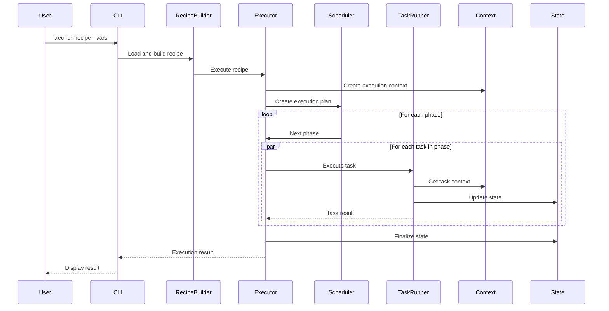

# 05. Xec Core Technical Specification v2.0

## 1. System Overview

### 1.1 Purpose
Xec Core is a framework for infrastructure orchestration and automation, built on TypeScript and using @xec-js/ush as the command execution engine.

### 1.2 Target Audience
- DevOps engineers
- SRE teams
- Developers working with infrastructure
- System architects

### 1.3 Key Characteristics
- **Language**: TypeScript/JavaScript
- **Runtime**: Node.js 18+
- **License**: MIT
- **Versioning**: Semantic Versioning 2.0.0

## 2. System Requirements

### 2.1 Minimum Requirements
```json
{
  "node": ">=18.0.0",
  "npm": ">=8.0.0",
  "typescript": ">=5.0.0",
  "memory": "512MB",
  "disk": "100MB"
}
```

### 2.2 Recommended Requirements
```json
{
  "node": ">=20.0.0",
  "npm": ">=10.0.0",
  "typescript": ">=5.3.0",
  "memory": "2GB",
  "disk": "1GB",
  "cpu": "2 cores"
}
```

### 2.3 Supported Platforms
- Linux (x64, arm64)
- macOS (x64, arm64)
- Windows (x64) - via WSL2
- Docker containers

## 3. System Architecture

### 3.1 Component Diagram
```mermaid
graph TB
    subgraph "User Space"
        UC[User Code]
        CM[Custom Modules]
    end
    
    subgraph "Xec Core"
        CLI[CLI Layer]
        DSL[DSL Layer]
        CORE[Core Abstractions]
        ENG[Execution Engine]
        CTX[Context System]
        MOD[Module System]
        STATE[State Management]
        INT[Integration Layer]
    end
    
    subgraph "External Dependencies"
        USH[@xec-js/ush]
        NPM[NPM Modules]
        EXT[External Systems]
    end
    
    UC --> DSL
    CM --> MOD
    CLI --> DSL
    DSL --> CORE
    CORE --> ENG
    ENG --> CTX
    CTX --> MOD
    MOD --> STATE
    STATE --> INT
    INT --> USH
    INT --> EXT
    MOD --> NPM
```

### 3.2 System Layers

#### 3.2.1 CLI Layer
- **Purpose**: Command-line interface
- **Components**: Command parser, Output formatter, Interactive prompt
- **Dependencies**: Commander.js, Inquirer.js

#### 3.2.2 DSL Layer
- **Purpose**: Domain Specific Language for task definition
- **Components**: Task Builder, Recipe Builder, Pattern Builder
- **Patterns**: Fluent Interface, Builder Pattern

#### 3.2.3 Core Abstractions
- **Purpose**: Core types and interfaces
- **Components**: Task, Recipe, Module, Context interfaces
- **Principles**: SOLID, DRY, KISS

#### 3.2.4 Execution Engine
- **Purpose**: Task planning and execution
- **Components**: Scheduler, Executor, Phase Builder
- **Algorithms**: Topological sort, Dependency resolution

#### 3.2.5 Context System
- **Purpose**: Execution context management
- **Technology**: AsyncLocalStorage
- **Components**: Context Provider, Context Builder

#### 3.2.6 Module System
- **Purpose**: Extensibility and reuse
- **Components**: Module Registry, Module Loader, Helper Registry
- **Integration**: NPM ecosystem

#### 3.2.7 State Management
- **Purpose**: State management and persistence
- **Components**: Event Store, State Store, Ledger
- **Patterns**: Event Sourcing, CQRS

#### 3.2.8 Integration Layer
- **Purpose**: Integration with external systems
- **Adapters**: Ush, Kubernetes, Terraform, AWS, Docker
- **Pattern**: Adapter Pattern

## 4. Core Types and Interfaces

### 4.1 Task Interface
```typescript
interface Task {
  id: string;                    // Unique identifier
  name: string;                  // Human-readable name
  description?: string;          // Task description
  handler: TaskHandler;          // Execution function
  options: TaskOptions;          // Execution options
  dependencies: string[];        // Dependencies on other tasks
  tags: string[];               // Tags for grouping
  metadata?: Record<string, any>; // Arbitrary metadata
}

interface TaskOptions {
  retry?: RetryConfig;           // Retry configuration
  timeout?: number;              // Execution timeout
  when?: Condition;              // Execution condition
  hosts?: HostSelector;          // Host selector
  parallel?: boolean;            // Parallel execution
  continueOnError?: boolean;     // Continue on error
  vars?: Variables;              // Task variables
}

type TaskHandler = (context: TaskContext) => Promise<any>;
```

### 4.2 Recipe Interface
```typescript
interface Recipe {
  id: string;                    // Unique identifier
  name: string;                  // Recipe name
  version: string;               // Version (semver)
  description?: string;          // Description
  tasks: Map<string, Task>;      // Task collection
  phases: Map<string, Phase>;    // Execution phases
  vars: Variables;               // Variable definitions
  hooks: RecipeHooks;            // Lifecycle hooks
  metadata?: RecipeMetadata;     // Metadata
}

interface RecipeHooks {
  before?: Hook[];               // Before execution
  after?: Hook[];                // After execution
  onError?: ErrorHook[];         // On error
  finally?: Hook[];              // Always execute
}

interface Phase {
  name: string;                  // Phase name
  tasks: string[];               // Task IDs in phase
  parallel: boolean;             // Parallel execution
  continueOnError?: boolean;     // Continue on error
}
```

### 4.3 Context Interface
```typescript
interface TaskContext {
  taskId: string;                // Current task ID
  vars: Record<string, any>;     // Local variables
  host?: Host;                   // Current host
  phase?: string;                // Current phase
  attempt: number;               // Attempt number
  logger: Logger;                // Logger
  $: CallableExecutionEngine;    // Command execution engine
}

interface ExecutionContext extends TaskContext {
  recipeId: string;              // Recipe ID
  runId: string;                 // Run ID
  globalVars: Record<string, any>; // Global variables
  secrets: Record<string, any>;  // Secrets
  state: StateManager;           // State manager
  dryRun: boolean;               // Dry-run mode
  verbose: boolean;              // Verbose output
  startTime: number;             // Start time
}
```

### 4.4 Module Interface
```typescript
interface Module {
  name: string;                  // Module name
  version: string;               // Version
  description?: string;          // Description
  exports: ModuleExports;        // Exported components
  dependencies?: string[];       // Dependencies
  peerDependencies?: string[];   // Peer dependencies
  setup?: SetupFunction;         // Initialization function
  teardown?: TeardownFunction;   // Cleanup function
  config?: ModuleConfig;         // Configuration
}

interface ModuleExports {
  tasks?: Record<string, Task>;
  recipes?: Record<string, Recipe>;
  helpers?: Record<string, Helper>;
  patterns?: Record<string, Pattern>;
  integrations?: Record<string, Integration>;
}
```

## 5. Execution Flow

### 5.1 Recipe Execution Sequence


### 5.2 Task Execution Lifecycle
1. **Validation** - Input parameter validation
2. **Condition Check** - Execution condition check
3. **Pre-execution Hooks** - Execute before hooks
4. **Main Execution** - Execute handler
5. **Retry Logic** - Retries on errors
6. **Post-execution Hooks** - Execute after hooks
7. **State Update** - Update state
8. **Result Return** - Return result

## 6. Module System Specification

### 6.1 Module Resolution
```typescript
// Module search order
const resolutionOrder = [
  'built-in',      // Built-in modules
  'local',         // Local project modules
  'npm',           // NPM packages
  'registry'       // Remote registry
];

// Naming convention
const moduleNaming = {
  builtin: '@xec-js/stdlib-{name}',
  community: '@xec-community/{name}',
  private: '@{org}/xec-{name}'
};
```

### 6.2 Module Loading
```typescript
class ModuleLoader {
  async load(name: string): Promise<Module> {
    // 1. Check cache
    if (this.cache.has(name)) {
      return this.cache.get(name);
    }
    
    // 2. Resolve module path
    const path = await this.resolve(name);
    
    // 3. Load module
    const module = await import(path);
    
    // 4. Validate module
    this.validate(module);
    
    // 5. Initialize module
    if (module.setup) {
      await module.setup(this.context);
    }
    
    // 6. Cache module
    this.cache.set(name, module);
    
    return module;
  }
}
```

## 7. State Management Specification

### 7.1 Event Structure
```typescript
interface Event {
  id: string;                    // UUID v4
  type: string;                  // Event type
  timestamp: number;             // Unix timestamp
  actor: string;                 // User/system who triggered
  resource: string;              // Affected resource
  action: string;                // Action performed
  payload: any;                  // Event data
  metadata: EventMetadata;       // Additional metadata
  signature?: string;            // Digital signature
}

interface EventMetadata {
  correlationId: string;         // Track related events
  causationId: string;           // Track causality
  version: number;               // Event version
  tags: Map<string, string>;     // Custom tags
  source: string;                // Event source
}
```

### 7.2 State Storage
```typescript
interface StateStorage {
  // Key-value operations
  get(key: string): Promise<any>;
  set(key: string, value: any): Promise<void>;
  delete(key: string): Promise<void>;
  
  // Batch operations
  getBatch(keys: string[]): Promise<Map<string, any>>;
  setBatch(entries: Map<string, any>): Promise<void>;
  
  // Query operations
  query(filter: StateFilter): Promise<StateEntry[]>;
  count(filter: StateFilter): Promise<number>;
  
  // Transaction support
  transaction<T>(fn: (tx: Transaction) => Promise<T>): Promise<T>;
}
```

## 8. Security Specification

### 8.1 Authentication
```typescript
interface AuthProvider {
  authenticate(credentials: Credentials): Promise<AuthToken>;
  validate(token: AuthToken): Promise<boolean>;
  refresh(token: AuthToken): Promise<AuthToken>;
  revoke(token: AuthToken): Promise<void>;
}

// Supported auth methods
enum AuthMethod {
  API_KEY = 'api_key',
  JWT = 'jwt',
  OAUTH2 = 'oauth2',
  MTLS = 'mtls'
}
```

### 8.2 Authorization
```typescript
interface AuthorizationPolicy {
  subject: string;               // User/role
  resource: string;              // Resource pattern
  actions: string[];             // Allowed actions
  conditions?: PolicyCondition[]; // Additional conditions
}

interface PolicyCondition {
  field: string;                 // Field to check
  operator: ComparisonOperator;  // Comparison operator
  value: any;                    // Expected value
}
```

### 8.3 Encryption
```typescript
interface EncryptionProvider {
  algorithm: EncryptionAlgorithm;
  keySize: number;
  
  encrypt(data: Buffer, key: Buffer): Promise<Buffer>;
  decrypt(data: Buffer, key: Buffer): Promise<Buffer>;
  generateKey(): Promise<Buffer>;
  deriveKey(password: string, salt: Buffer): Promise<Buffer>;
}

enum EncryptionAlgorithm {
  AES_256_GCM = 'aes-256-gcm',
  CHACHA20_POLY1305 = 'chacha20-poly1305'
}
```

## 9. Performance Specifications

### 9.1 Performance Targets
| Metric | Target | Maximum |
|--------|--------|---------|
| Task startup time | < 10ms | 50ms |
| Context switch overhead | < 1ms | 5ms |
| Module load time | < 100ms | 500ms |
| State query time | < 10ms | 100ms |
| Event processing | < 5ms | 20ms |

### 9.2 Scalability Limits
| Resource | Soft Limit | Hard Limit |
|----------|------------|------------|
| Concurrent tasks | 100 | 1000 |
| Total tasks per recipe | 1000 | 10000 |
| State size | 100MB | 1GB |
| Event store size | 1GB | 10GB |
| Module count | 100 | 1000 |

### 9.3 Optimization Strategies
1. **Connection Pooling** - Reuse SSH/HTTP connections
2. **Lazy Loading** - Load modules on demand
3. **Parallel Execution** - Execute independent tasks concurrently
4. **Caching** - Cache module resolution and state queries
5. **Batching** - Batch state updates and event writes

## 10. Error Handling Specification

### 10.1 Error Hierarchy
```typescript
// Base error
class XecError extends Error {
  code: string;
  details?: any;
  cause?: Error;
  timestamp: number;
  context?: ErrorContext;
}

// Specific errors
class TaskError extends XecError
class ValidationError extends XecError
class ExecutionError extends XecError
class StateError extends XecError
class ModuleError extends XecError
class NetworkError extends XecError
class SecurityError extends XecError
```

### 10.2 Error Recovery
```typescript
interface ErrorRecoveryStrategy {
  shouldRetry(error: Error, attempt: number): boolean;
  getDelay(attempt: number): number;
  transform(error: Error): Error;
  compensate?(error: Error, context: Context): Promise<void>;
}

// Built-in strategies
const strategies = {
  exponentialBackoff: {
    shouldRetry: (err, attempt) => attempt < 3,
    getDelay: (attempt) => Math.pow(2, attempt) * 1000
  },
  
  circuitBreaker: {
    shouldRetry: (err, attempt) => !this.isOpen(),
    getDelay: () => 0,
    transform: (err) => this.isOpen() ? new CircuitOpenError() : err
  }
};
```

## 11. Compatibility and Migration

### 11.1 Version Compatibility Matrix
| Xec Core | Node.js | TypeScript | @xec-js/ush |
|-----------|---------|------------|---------------|
| 2.0.x | 18+ | 5.0+ | 1.0+ |
| 2.1.x | 18+ | 5.2+ | 1.1+ |
| 3.0.x | 20+ | 5.3+ | 2.0+ |

### 11.2 Breaking Changes Policy
- Major version: Breaking changes allowed
- Minor version: New features, no breaking changes
- Patch version: Bug fixes only
- Deprecation period: 2 minor versions minimum

### 11.3 Migration Path
```typescript
// Version detection
const version = getXecVersion();

// Migration helpers
if (version.major < 2) {
  console.warn('Please run migration tool: npx @xec-js/migrate');
}

// Compatibility layer
const compat = {
  // v1 API compatibility
  createTask: deprecate(task, 'Use task() instead'),
  createRecipe: deprecate(recipe, 'Use recipe() instead')
};
```

## 12. Testing Specification

### 12.1 Test Categories
1. **Unit Tests** - Individual components
2. **Integration Tests** - Component interactions
3. **E2E Tests** - Full workflow tests
4. **Performance Tests** - Benchmarks
5. **Security Tests** - Vulnerability scanning

### 12.2 Test Framework
```typescript
interface TestFramework {
  runner: 'vitest';
  coverage: {
    tool: 'c8';
    threshold: {
      statements: 90;
      branches: 85;
      functions: 90;
      lines: 90;
    };
  };
  mocking: {
    tasks: MockTaskRunner;
    execution: MockExecutionEngine;
    state: MockStateManager;
  };
}
```

## 13. Deployment Specification

### 13.1 Package Structure
```
@xec-js/core/
├── dist/              # Compiled JavaScript
│   ├── cjs/          # CommonJS modules
│   ├── esm/          # ES modules
│   └── types/        # TypeScript declarations
├── bin/              # CLI executables
├── templates/        # Project templates
└── schemas/          # JSON schemas
```

### 13.2 Distribution Channels
1. **NPM Registry** - Primary distribution
2. **GitHub Packages** - Alternative registry
3. **Docker Hub** - Container images
4. **CDN** - Browser builds (if applicable)

## 14. Future Considerations

### 14.1 Planned Features
1. **WebAssembly Support** - WASM modules
2. **Remote Execution** - Distributed task execution
3. **GUI Builder** - Visual recipe builder
4. **AI Integration** - Intelligent task suggestions

### 14.2 Research Areas
1. **Quantum-safe Cryptography** - Post-quantum algorithms
2. **Edge Computing** - Edge node support
3. **Blockchain Integration** - Immutable audit logs
4. **Machine Learning** - Predictive scaling

## 15. Appendices

### 15.1 Glossary
- **Task**: Atomic unit of work
- **Recipe**: Collection of tasks
- **Module**: Reusable component package
- **Context**: Execution environment
- **State**: Persistent data storage
- **Phase**: Execution stage
- **Hook**: Lifecycle callback

### 15.2 References
1. Node.js AsyncLocalStorage: https://nodejs.org/api/async_context.html
2. Semantic Versioning: https://semver.org/
3. TypeScript Handbook: https://www.typescriptlang.org/docs/
4. Event Sourcing: https://martinfowler.com/eaaDev/EventSourcing.html

### 15.3 License
```
MIT License

Copyright (c) 2024 Xec Team

Permission is hereby granted, free of charge, to any person obtaining a copy
of this software and associated documentation files (the "Software"), to deal
in the Software without restriction, including without limitation the rights
to use, copy, modify, merge, publish, distribute, sublicense, and/or sell
copies of the Software, and to permit persons to whom the Software is
furnished to do so, subject to the following conditions:

The above copyright notice and this permission notice shall be included in all
copies or substantial portions of the Software.

THE SOFTWARE IS PROVIDED "AS IS", WITHOUT WARRANTY OF ANY KIND, EXPRESS OR
IMPLIED, INCLUDING BUT NOT LIMITED TO THE WARRANTIES OF MERCHANTABILITY,
FITNESS FOR A PARTICULAR PURPOSE AND NONINFRINGEMENT. IN NO EVENT SHALL THE
AUTHORS OR COPYRIGHT HOLDERS BE LIABLE FOR ANY CLAIM, DAMAGES OR OTHER
LIABILITY, WHETHER IN AN ACTION OF CONTRACT, TORT OR OTHERWISE, ARISING FROM,
OUT OF OR IN CONNECTION WITH THE SOFTWARE OR THE USE OR OTHER DEALINGS IN THE
SOFTWARE.
```