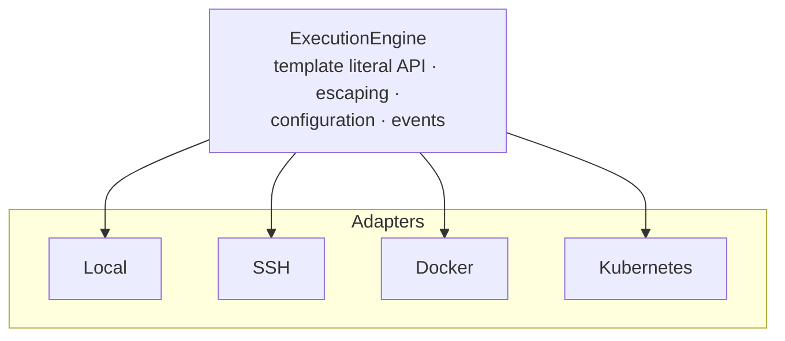

# Universal Execution Engine

The Execution Engine (`ExecutionEngine`) is the core of the Xec system, providing unified command execution across diverse environments. It offers a universal API for working with local processes, SSH connections, Docker containers, and Kubernetes pods.

## Core Concepts

### Universal Execution

The engine abstracts environment-specific details, allowing the same code to work across different target systems:

```typescript
import { $ } from '@xec-sh/core';

// Local execution
await $`ls -la`;

// SSH execution — string shorthand or options object
const remote = $.ssh('user@server.com');           // [user@]host[:port]
// const remote = $.ssh({ host: 'server.com', username: 'user' });
await remote`ls -la`;

// Docker execution
const container = $.docker({ container: 'my-app' });
await container`ls -la`;

// Kubernetes execution — string shorthand or options object
const pod = $.k8s('my-pod');                       // [namespace/]pod[:container]
// const pod = $.k8s({ pod: 'my-pod', namespace: 'default' });
await pod`ls -la`;

// The pod object API: $.k8s().pod(name) returns a K8sPod whose
// commands run via .exec (the pod object itself is not callable)
await $.k8s().pod('my-pod').exec`ls -la`;
```

### Engine Architecture

The engine parses the template literal, builds and escapes the command, then routes it to the adapter for the target environment:



## Command Lifecycle

### 1. Command Building

Commands are built through template literals with automatic escaping:

```typescript
const file = "file with spaces.txt";
const dangerous = "'; rm -rf /";

// Safe escaping — each value becomes one POSIX-quoted argument
await $`cat ${file}`;        // cat 'file with spaces.txt'
await $`echo ${dangerous}`;  // echo ''\''; rm -rf /'
```

### 2. Context Configuration

Commands are enriched with execution context:

```typescript
// Global configuration
const $ = new ExecutionEngine({
  defaultTimeout: 30000,
  defaultCwd: '/app',
  defaultEnv: { NODE_ENV: 'production' }
});

// Local configuration
await $`npm start`
  .cwd('/projects/app')
  .env({ DEBUG: 'true' })
  .timeout(60000);
```

### 3. Adapter Selection

The engine automatically selects the appropriate adapter:

```typescript
// Explicit selection via method
const ssh = $.ssh({ host: 'server', username: 'deploy' });

// Automatic selection via options — adapterOptions.type must match adapter
await $.execute({
  command: 'ls',
  adapter: 'docker',
  adapterOptions: { type: 'docker', container: 'app' }
});
```

### 4. Execution and Result Processing

```typescript
const result = await $`ls -la`;

// Result contains:
result.stdout;      // Standard output
result.stderr;      // Error output
result.exitCode;    // Exit code
result.ok;          // true when exitCode === 0
result.duration;    // Execution time (ms)
result.startedAt;   // Start time
result.finishedAt;  // Finish time
```

## ProcessPromise API

`ProcessPromise` is an extended Promise with additional methods for execution control:

### Stream Management

```typescript
// Output redirection
await $`ls -la`
  .stdout(process.stdout)
  .stderr(process.stderr);

// Interactive mode
await $`npm init`.interactive();

// Quiet mode (no output)
await $`npm install`.quiet();
```

### Error Handling

```typescript
// Don't throw on error
const result = await $`may-fail`.nothrow();
if (result.exitCode !== 0) {
  console.log('Command failed:', result.stderr);
}

// Retry on failure (engine-level: $.retry() returns a derived engine)
await $.retry({
  maxRetries: 3,
  initialDelay: 1000
})`flaky-command`;
```

### Execution Control

```typescript
// Timeout
await $`long-running`.timeout(5000);

// Cancellation via AbortSignal
const controller = new AbortController();
const promise = $`sleep 100`.signal(controller.signal);
setTimeout(() => controller.abort(), 1000);

// Force termination
const proc = $`server`;
setTimeout(() => proc.kill(), 5000);
```

### Result Transformation

```typescript
// Get trimmed text
const text = await $`cat file.txt`.text();

// Parse JSON
const data = await $`cat config.json`.json();

// Array of lines
const lines = await $`ls`.lines();

// Buffer
const buffer = await $`cat binary.dat`.buffer();
```

## Piping

The engine supports Unix-like pipes:

```typescript
// Simple pipe — pipe to a command string, not another $`...` ProcessPromise;
// piping directly to a second tagged-template command does not carry its
// output through correctly in the current build.
await $`cat file.txt`.pipe('grep pattern').pipe('wc -l');

// Pipe to a function — called once per output line
await $`ls -la`.pipe((line) => {
  if (line.includes('.txt')) console.log(line);
});

// Pipe to a writable stream (e.g. a file)
import { createWriteStream } from 'node:fs';
await $`generate-report`.pipe(createWriteStream('report.txt'));
```

## Parallel Execution

```typescript
// Execute multiple commands in parallel
const results = await $.parallel.all([
  $`test-unit`,
  $`test-integration`,
  $`test-e2e`
]);

// With concurrency limit
await $.batch(commands, {
  concurrency: 5,
  onProgress: (completed, total) => {
    console.log(`Progress: ${completed}/${total}`);
  }
});
```

## Events and Monitoring

The engine provides an event system for monitoring:

```typescript
const $ = new ExecutionEngine();

$.on('command:start', ({ command, cwd }) => {
  console.log(`Starting: ${command} in ${cwd}`);
});

$.on('command:complete', ({ command, exitCode, duration }) => {
  console.log(`Completed: ${command} (${exitCode}) in ${duration}ms`);
});

$.on('command:error', ({ command, error }) => {
  console.error(`Failed: ${command}`, error);
});
```

## Result Caching

```typescript
// Cache command results
const data = await $`expensive-operation`.cache({
  ttl: 60000,  // 1 minute
  key: 'operation-result'
});

// Subsequent calls return cached result
const cached = await $`expensive-operation`.cache({
  key: 'operation-result'
});
```

## Contextual Execution

```typescript
// Create context with settings
const context = $.with({
  cwd: '/app',
  env: { NODE_ENV: 'production' },
  timeout: 30000
});

// All commands in context inherit settings
await context`npm install`;
await context`npm build`;
await context`npm test`;

// Nested contexts — within() is a standalone import, not a $ method
import { within } from '@xec-sh/core';

await within(async () => {
  // $.defaults() inside a within() scope writes to the scope instead of
  // the process-wide engine, so this cwd change doesn't leak outside the
  // callback. $.cd('/project') would not do this — it returns a new
  // engine rather than mutating $, so a bare $.cd(...) statement with a
  // discarded return value has no effect.
  $.defaults({ cwd: '/project' });
  await $`npm install`;
  await $`npm test`;
});
```

## Command Templates

```typescript
// Create a template
const gitClone = $.template('git clone {{repo}} {{dir}}', {
  defaults: { dir: '.' },
  validate: (params) => {
    if (!params.repo?.startsWith('http')) {
      throw new Error('Invalid repo URL');
    }
  }
});

// Use the template
await gitClone.execute($, {
  repo: 'https://github.com/user/repo.git',
  dir: '/projects/repo'
});
```

## Utilities and Helpers

### Temporary Files

```typescript
// Create temporary file
const temp = await $.tempFile({ prefix: 'data-' });
await $`echo "test" > ${temp.path}`;
await temp.cleanup();

// Automatic cleanup
await $.withTempFile(async (path) => {
  await $`process-data > ${path}`;
  return $`upload ${path}`;
});

// Same for a directory
await $.withTempDir(async (dir) => {
  await $`git clone ${repo} ${dir}`;
});
```

### Helper Functions

Standalone helpers exported from the package:

```typescript
import { echo, glob, kill, sleep, xfetch, readStdin, expBackoff, parseDuration } from '@xec-sh/core';

echo`Deploying ${target}`;                    // print without spawning a process
await sleep('2s');                            // duration string or milliseconds
const files = await glob('src/**/*.ts');      // dependency-free globbing
await kill(pid, 'SIGTERM');                   // kill a process (and its group on POSIX)
const resp = await xfetch('https://api.example.com/data.json');  // fetch, cross-runtime
const input = await readStdin();              // read all of stdin as a string

parseDuration('30s');                          // 30000
for (const delay of expBackoff(60_000, 50)) {  // infinite series: 50, 100, 200, ... capped at 60000
  await sleep(delay);
  if (await tryConnect()) break;
}
```

### File Transfer

```typescript
// Between environments: ssh://user@host/path, docker://container:/path
await $.transfer.copy(
  '/local/file.txt',
  'ssh://deploy@server/app/file.txt'
);

// With progress
await $.transfer.sync('/source', 'docker://app:/dest', {
  onProgress: (progress) => {
    console.log(`${progress.transferredBytes}/${progress.totalBytes} bytes`);
  }
});
```

### Interactive Prompts

Interactive prompts are not part of `@xec-sh/core` — they live in `@xec-sh/kit`,
the separate TUI/CLI components package:

```typescript
import { text, confirm, select, password } from '@xec-sh/kit';

const name = await text({ message: 'Enter name:' });
const proceed = await confirm({ message: 'Continue?' });
const option = await select({
  message: 'Choose:',
  options: [{ value: 'dev' }, { value: 'staging' }, { value: 'prod' }],
});
const secret = await password({ message: 'Password:' });
```

## Error Handling

```typescript
try {
  await $`risky-command`;
} catch (error) {
  if (error.code === 'COMMAND_FAILED') {
    console.log('Exit code:', error.exitCode);
    console.log('Stderr:', error.stderr);
  }
}

// Or with nothrow
const result = await $`risky-command`.nothrow();
if (!result.ok) {
  console.log('Failed with:', result.stderr);
}
```

## Runtime Support

`@xec-sh/core` runs on Node.js 20+, Bun and Deno with the same API. The local adapter detects the runtime (`RuntimeDetector`) and uses `Bun.spawn` under Bun for faster process startup; Deno works through its Node compatibility layer. Importing the package pulls in Node builtins only — SSH, Docker and Kubernetes adapters load lazily on first use.

```typescript
import { RuntimeDetector } from '@xec-sh/core';

RuntimeDetector.detect(); // 'node' | 'bun' | 'deno'
```

## Performance and Optimizations

### Connection Pooling

SSH and other adapters automatically manage connection pools:

```typescript
const ssh = $.ssh({ host: 'server', username: 'deploy' });

// Uses single connection
for (const file of files) {
  await ssh`process ${file}`;
}
```

### Lazy Initialization

Adapters are created only on first use:

```typescript
// Docker adapter created only here
await $.docker({ container: 'app' })`ls`;
```

### Stream Processing

```typescript
// Process large outputs line by line without buffering
for await (const line of $`generate-huge-output`) {
  await processLine(line);
}
```

## Security

### Automatic Escaping

All template literal values are automatically escaped — each interpolated
value becomes exactly one shell argument:

```typescript
const userInput = "'; DROP TABLE users; --";
const sql = `SELECT * FROM data WHERE name = ${userInput}`; // plain JS string
await $`mysql -e ${sql}`;
// Safe: the whole -e argument is one escaped token
```

Do not wrap an interpolation in your own quotes inside the template
(`` $`mysql -e "... ${userInput} ..."` ``). Xec escapes each value for a
position with no surrounding quotes; splicing that escaped value inside
quotes you wrote yourself is no longer the position it was escaped for, and
a value containing a `"` can close your quotes early and reach the shell —
build the whole argument as one interpolated value instead, as above.

### Sensitive Data Masking

Masking is enabled by default in every adapter: passwords, tokens, and keys
matching the built-in patterns are replaced with `[REDACTED]` in events and
error messages. It is configured per adapter:

```typescript
const $ = new ExecutionEngine({
  adapters: {
    local: {
      sensitiveDataMasking: {
        enabled: true,
        patterns: [/password=\w+/gi],
        replacement: '[REDACTED]'
      }
    }
  }
});
```

## Integration with async/await

The engine is fully compatible with async/await and Promise APIs:

```typescript
// Promise chaining
$`npm test`
  .then(result => console.log('Tests passed'))
  .catch(error => console.error('Tests failed'));

// Promise.all
const [test, lint, build] = await Promise.all([
  $`npm test`,
  $`npm run lint`,
  $`npm run build`
]);

// Promise.race
const fastest = await Promise.race([
  $`fetch-from-cache`,
  $`fetch-from-api`
]);
```

## Extensibility

### Registering Adapters

`$.registerAdapter(name, adapter)` is real, but writing the adapter itself
currently is not: every adapter extends the abstract `BaseAdapter` class,
which is not exported from `@xec-sh/core` and depends on several other
internal-only classes (`StreamHandler`, `ProgressReporter`, the masking
stream filter). There is no supported way to implement a custom adapter
outside the package today — `registerAdapter` exists for the four built-in
adapters to register themselves, not as a public extension point.

### Event Listeners

```typescript
// Add logging via events (listeners observe execution;
// they cannot modify results)
$.on('command:start', async (event) => {
  await logger.log('Command started', event);
});

$.on('command:complete', async (event) => {
  await metrics.record(event.duration);
});
```

## Usage Examples

### CI/CD Pipeline

```typescript
async function deploy(environment: string) {
  const $ = new ExecutionEngine();
  
  // Build
  await $`npm ci`;
  await $`npm run build`;
  
  // Tests
  const tests = await $`npm test`.nothrow();
  if (!tests.ok) {
    throw new Error('Tests failed');
  }
  
  // Deploy
  const server = $.ssh({
    host: `${environment}.example.com`,
    username: 'deploy'
  });
  
  await server`cd /app && git pull`;
  await server`npm ci --production`;
  await server`pm2 restart app`;
}
```

### Data Processing

```typescript
async function processLogs() {
  // Get logs from different sources
  const [app1, app2, db] = await $.parallel.all([
    $.docker({ container: 'app1' })`tail -n 1000 /logs/app.log`,
    $.docker({ container: 'app2' })`tail -n 1000 /logs/app.log`,
    $.ssh({ host: 'db-server', username: 'deploy' })`tail -n 1000 /var/log/mysql/error.log`
  ]);
  
  // Process and aggregate
  const errors = [app1.stdout, app2.stdout, db.stdout]
    .flatMap(output => output.split('\n'))
    .filter(line => line.includes('ERROR'));
  
  // Save results
  await $`echo ${errors.join('\n')} > errors-report.txt`;
}
```

### System Monitoring

`$.parallel.map()` builds one command per item and runs them with a
concurrency cap — its callback must return a `string`, `Command` or
`ProcessPromise`, not an arbitrary computed value, and the method itself
resolves a `ParallelResult` rather than an array of your callback's return
values. Gathering several distinct metrics per server and combining them
into one object per server is a plain concurrent-map problem instead:

```typescript
async function monitorSystem() {
  const servers = ['web1', 'web2', 'db1'];

  while (true) {
    const metrics = await Promise.all(
      servers.map(async (server) => {
        const ssh = $.ssh({ host: `${server}.local`, username: 'monitor' });

        const cpu = await ssh`top -bn1 | grep "Cpu(s)"`.text();
        const memory = await ssh`free -m | grep "Mem:"`.text();
        const disk = await ssh`df -h | grep "/dev/sda1"`.text();

        return { server, cpu, memory, disk };
      })
    );

    console.table(metrics);
    await new Promise(resolve => setTimeout(resolve, 5000));
  }
}
```

## Conclusion

The ExecutionEngine provides a powerful and flexible API for command execution across various environments. Its key advantages:

- **Universality**: Single API for all environments
- **Security**: Automatic escaping and data masking
- **Performance**: Connection pooling and caching
- **Convenience**: Intuitive API with modern JavaScript support
- **Extensibility**: Adapter and event systems

The engine serves as a foundation for building complex automation systems, CI/CD pipelines, and infrastructure management tools.